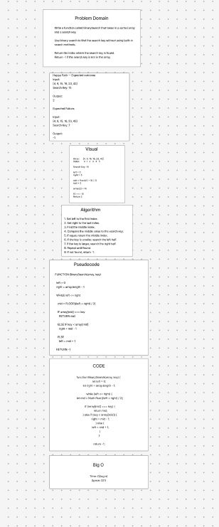

# Binary Search

## Summary

Write a function called `BinarySearch` that searches a sorted array for a given search key.

## Description

The `BinarySearch` function takes two parameters: a sorted array and a search key.

Using a binary search algorithm, the function repeatedly divides the search area in half until the search key is found.

If the search key is found, return the index of that element. If the search key is not present in the array, return `-1`.

Built-in search methods will not be used.

## Whiteboard Process

## Approach & Efficiency

We will use binary search by comparing the search key to the middle element of the sorted array.

- If the middle element equals the search key, return its index.
- If the search key is smaller, continue searching the left half.
- If the search key is larger, continue searching the right half.
- If there are no elements left to search, return `-1`.

**Time:** O(log n)

**Space:** O(1)

## Solution

The solution will be demonstrated in the whiteboard process.