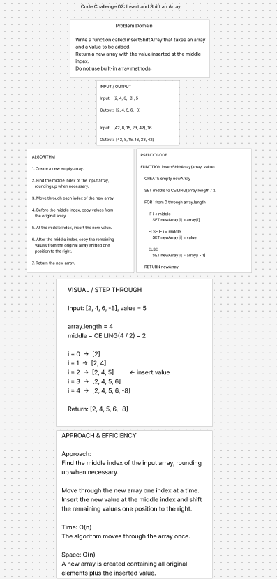

# Insert and Shift an Array

## Summary

Write a function called `insertShiftArray` that takes an array and a value as arguments and returns a new array with the value inserted at the middle index.

## Description

Given an input array and a value, determine the middle index of the array.

Create a new array and copy the values from the original array into it.

When the middle index is reached, place the new value into the new array and shift the remaining values one position to the right.

Return the new array containing the inserted value.

### Examples

Input:

[2, 4, 6, -8], 5

Output:

[2, 4, 5, 6, -8]

Input:

[42, 8, 15, 23, 42], 16

Output:

[42, 8, 15, 16, 23, 42]

## Whiteboard Process



## Approach & Efficiency

### Approach

Find the middle index of the input array by dividing the array length by 2 and rounding up when necessary.

Create a new array and move through each index.

Copy the original values that come before the middle index into the new array.

At the middle index, insert the new value.

After the middle index, copy the remaining original values one position to the right.

Return the new array.

### Big O

**Time Complexity: O(n)**

The algorithm moves through the array one time.

**Space Complexity: O(n)**

The algorithm creates a new array containing all of the original elements plus the inserted value.

## Algorithm

1. Create a new empty array.
2. Find the middle index of the input array, rounding up when necessary.
3. Move through each index of the new array.
4. Before the middle index, copy values from the original array.
5. At the middle index, insert the new value.
6. After the middle index, copy the remaining values from the original array shifted one position to the right.
7. Return the new array.

## Pseudocode

FUNCTION insertShiftArray(array, value)

    CREATE empty newArray

    SET middle to CEILING(array.length / 2)

    FOR i from 0 through array.length

        IF i < middle
            SET newArray[i] = array[i]

        ELSE IF i = middle
            SET newArray[i] = value

        ELSE
            SET newArray[i] = array[i - 1]

    RETURN newArray
END FUNCTION

## Solution

The `insertShiftArray` function finds the middle index of the input array using `Math.ceil()` so that an odd-length array rounds up to the correct middle index.

It then creates a new array. Values before the middle are copied normally, the new value is inserted at the middle index, and the remaining values are shifted one position to the right.

```javascript
function insertShiftArray(array, value) {
  const newArray = [];
  const middle = Math.ceil(array.length / 2);

  for (let i = 0; i <= array.length; i++) {
    if (i < middle) {
      newArray[i] = array[i];
    } else if (i === middle) {
      newArray[i] = value;
    } else {
      newArray[i] = array[i - 1];
    }
  }

  return newArray;
}
```  

## Checklist

### Required

- [x] Top-level README “Table of Contents” is updated
- [x] README for this challenge is complete
- [x] Summary, Description, Approach & Efficiency, Solution
- [x] Picture of whiteboard
- [x] Feature tasks for this challenge are completed

### Optional Implementation & Testing

The assignment states that completing external code and a test suite is optional. For this challenge, the solution code is included in the README and whiteboard.

- [ ] Link to code
- [ ] Unit tests written and passing
- [ ] “Happy Path” - Expected outcome
- [ ] Expected failure
- [ ] Edge Case (if applicable/obvious)