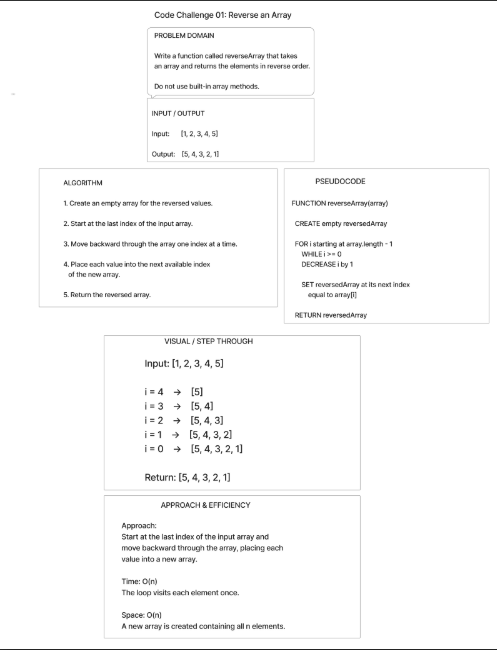

# Reverse an Array

## Summary

Write a function called `reverseArray` that takes an array as an argument and returns a new array with the elements in reverse order.

Do not use built-in array methods such as `.reverse()`.

## Description

Given an input array, iterate through the elements from the end of the array to the beginning and place each element into a new array.

Example:

Input:

```text
[1, 2, 3, 4, 5]
```

Output:

```text
[5, 4, 3, 2, 1]
``` 

## Whiteboard Process



## Approach & Efficiency 

### Approach

Start at the last index of the input array and move backward through the array.

For each element, place that value into a new array.

Continue moving backward until the first element has been added.

Return the new reversed array.

### Big O

**Time Complexity: O(n)**

The algorithm visits every element in the input array one time.

**Space Complexity: O(n)**

The algorithm creates a new array containing the same number of elements as the input array.

## Algorithm

1. Create a new empty array to hold the reversed values.
2. Start at the last index of the input array.
3. Move backward through the input array one index at a time.
4. Add each value to the new array.
5. Continue until the first element has been added.
6. Return the new reversed array.

## Pseudocode

FUNCTION reverseArray(array)
    CREATE empty array called reversedArray

    FOR index starting at array.length - 1
        WHILE index is greater than or equal to 0
        DECREASE index by 1

        ADD array[index] to reversedArray

    RETURN reversedArray
END FUNCTION 

## Solution

The `reverseArray` function loops through the input array starting at the last index and moving toward the first index. Each value is placed into a new array using its next available index.

```javascript
function reverseArray(array) {
  const reversedArray = [];

  for (let i = array.length - 1; i >= 0; i--) {
    reversedArray[reversedArray.length] = array[i];
  }

  return reversedArray;
}
```

[View the JavaScript implementation](reverse-array.js)

[View the tests](reverse-array.test.js)

## Checklist

- [x] Top-level README “Table of Contents” is updated
- [x] README for this challenge is complete
- [x] Summary, Description, Approach & Efficiency, Solution
- [x] Picture of whiteboard
- [x] Link to code
- [x] Feature tasks for this challenge are completed
- [x] Unit tests written and passing
- [x] “Happy Path” - Expected outcome
- [x] Expected failure
- [x] Edge Case (if applicable/obvious)