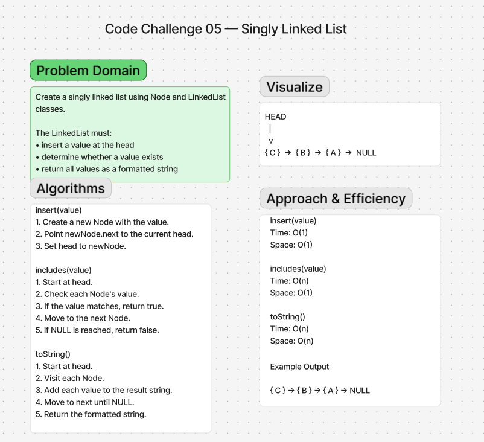

# Singly Linked List

## Summary

Implement a singly linked list data structure in JavaScript.

The linked list is made of Nodes. Each Node stores a value and a reference
to the next Node.

The LinkedList class keeps track of the first Node using a `head` property.

The required methods are:

- `insert(value)`
- `includes(value)`
- `toString()`

---

## Description

A singly linked list is a collection of Nodes connected in one direction.

Each Node contains:

- a `value`
- a `next` reference

The LinkedList contains:

- a `head` reference to the first Node

An empty linked list begins with:

```text
head -> null

---

## Approach & Efficiency

### `insert(value)`

The `insert()` method creates a new Node and places it at the head of the
linked list.

The new Node's `next` property points to the current head, and then the head
is updated to point to the new Node.

```text
Before:

head -> { B } -> { A } -> NULL

Insert C:

newNode -> { C }

After:

head -> { C } -> { B } -> { A } -> NULL

---

## Solution

The implementation contains two classes:

### Node

The `Node` class stores:

- `value` - the data contained in the Node
- `next` - a reference to the next Node

A new Node begins with its `next` property set to `null`.

### LinkedList

The `LinkedList` class begins with:

```javascript
this.head = null;
```

The class implements three required methods:

```text
insert(value)
includes(value)
toString()
```

The completed list can be visualized as:

```text
HEAD
 |
 v
{ C } -> { B } -> { A } -> NULL
```

---

## Testing

Jest is used to test the Linked List implementation.

The tests verify that the implementation:

- can successfully instantiate an empty linked list
- can properly insert into the linked list
- properly points the head to the first Node
- can properly insert multiple Nodes
- returns `true` when a requested value exists
- returns `false` when a requested value does not exist
- properly returns all values as a formatted string

The tests can be run from the `javascript` directory with:

```bash
npm test -- linked-list
```

At completion, all six tests pass and the Linked List implementation has
100% statement, branch, function, and line coverage.

---

## Happy Path

Given a new Linked List:

```javascript
const list = new LinkedList();

list.insert('A');
list.insert('B');
list.insert('C');
```

The resulting list is:

```text
HEAD -> { C } -> { B } -> { A } -> NULL
```

Searching for a value that exists:

```javascript
list.includes('B');
```

returns:

```text
true
```

Calling:

```javascript
list.toString();
```

returns:

```text
{ C } -> { B } -> { A } -> NULL
```

---

## Expected Failure

When `includes()` searches for a value that is not contained in the linked
list, it traverses the list until it reaches `null` and returns `false`.

Example:

```javascript
list.includes('Z');
```

returns:

```text
false
```

---

## Edge Case

An empty Linked List has:

```text
head -> null
```

Calling `includes()` on an empty list returns `false` because there are no
Nodes to search.

## Running Tests

If you setup your folders according to the above guidelines, running tests becomes a matter of deciding which tests you want to execute.  Jest does a good job at finding the test files that match what you specify in the test command

From the `data-structures-and-algorithms/javascript` folder, execute the following commands:

- **Run every possible test** - `npm test`
- **Run a test for a data structure** - `npm test linked-list`
- **Run a test for a specific challenge** - `npm test reverse-ll`

#### Live Tests

Note that when you check your code into GitHub, all of your tests will automatically execute. These results should match your own, and will be found on the  **Actions** tab

---

## Whiteboard Process



---

## Link to Code

[Linked List Implementation](./index.js)