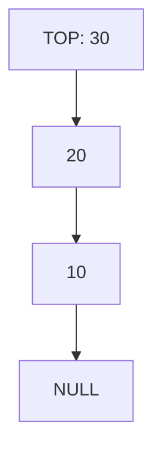
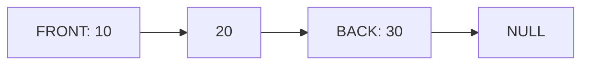

# Stack and Queue Whiteboard

## Stack — LIFO

```mermaid
flowchart TD
    A["TOP: 30"] --> B["20"]
    B --> C["10"]
    C --> D["NULL"]
```

The Stack removes the most recently added node first.

## Queue — FIFO

```mermaid
flowchart LR
    A["FRONT: 10"] --> B["20"]
    B --> C["BACK: 30"]
    C --> D["NULL"]
```

The Queue removes the earliest added node first.